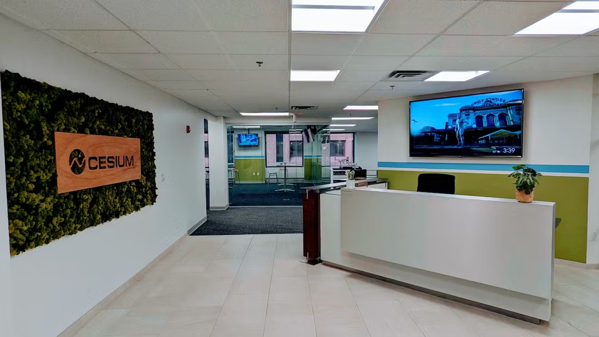
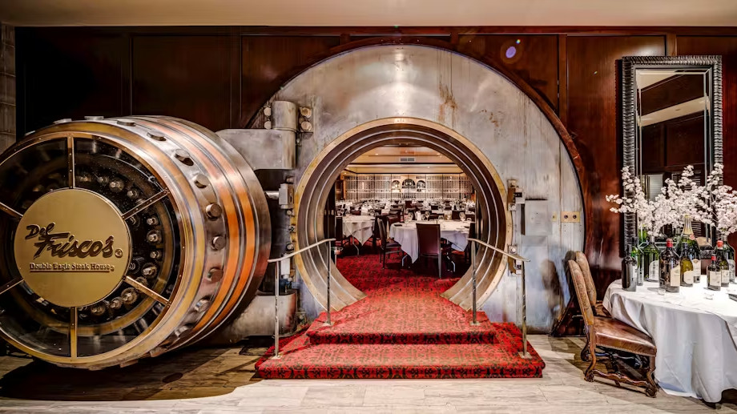

* This bulletpoint is necessary for kramdown to generate the ToC
{:toc}

# Conference Venue {#ConferenceVenue}

    

        <iframe src="https://drive.google.com/file/d/1GNzmEGDfyRHJtiPoPrprkjb4KjGR8INE/preview"></iframe>
    

### Cesium  will host I3D 2024!

We are pleased to announce that I3D 2024 will take place at Cesium in Philadelphia, PA, United States.



## Location 
Cesium office is located at:

400 Market St, Philadelphia, PA 19106

    <iframe style="width:100%;height:500px" src="https://www.google.com/maps/embed?pb=!1m18!1m12!1m3!1d2162.7631658920036!2d-75.14950469155715!3d39.950134825432386!2m3!1f0!2f0!3f0!3m2!1i1024!2i768!4f13.1!3m3!1m2!1s0x89c6c981093646d7%3A0xc117d14670c0778f!2sCesium!5e0!3m2!1sen!2shk!4v1710255557130!5m2!1sen!2shk"  allowfullscreen="" loading="lazy" referrerpolicy="no-referrer-when-downgrade"></iframe>

This is the entrance to Cesium.

*More details will be provided in the near future*

---

# Reception Venue

The reception dinner on the 8th of May will be in the Cesium offices.

---

# Banquet Venue

On Thursday 9th of May, we will be having a banquet dinner at [Del Frisco's](https://www.delfriscos.com/private-events-philadelphia-pa/).

## Location

1428-1432 Chestnut St
Philadelphia, PA 19102

    <iframe src="https://www.google.com/maps/embed?pb=!1m18!1m12!1m3!1d3058.5722649000154!2d-75.1654591!3d39.950956399999995!2m3!1f0!2f0!3f0!3m2!1i1024!2i768!4f13.1!3m3!1m2!1s0x89c6c62fc4813459%3A0x78308acf8d2ef653!2sDel%20Frisco&#39;s%20Double%20Eagle%20Steakhouse!5e0!3m2!1sen!2ses!4v1714678287781!5m2!1sen!2ses" style="width: 100%; height: 500px;" allowfullscreen="" loading="lazy" referrerpolicy="no-referrer-when-downgrade"></iframe>

---

# Lodging {#Lodging}
Here are some suggestions of hotels you could consider staying in. We don't have any agreement with them for the conference, so feel free to look around for other options that better match your needs.

### 1-2 blocks from Cesium

__Renaissance Philadelphia__ &#9733;&#9733;&#9733;&#9733; \
401 Chestnut St, Philadelphia, PA 19106 \
Phone: 215-925-0000\
[Website Link](https://www.marriott.com/en-us/hotels/phlpr-renaissance-philadelphia-downtown-hotel/overview/)

__Wyndham Philadelphia Historic District__ &#9733;&#9733;&#9733;\
400 Arch St, Philadelphia, PA 19106\
Phone: 877-999-3223\
[Website Link](https://www.wyndhamhotels.com/wyndham/philadelphia-pennsylvania/wyndham-philadelphia-historic-district/overview)

### 4-5 blocks from Cesium

__Philadelphia Marriott Old City__ &#9733;&#9733;&#9733;&#9733;\
One Dock St, Philadelphia, PA 19106\
Phone: 121-523-86000\
[Website Link](https://www.marriott.com/en-us/hotels/phlmo-philadelphia-marriott-old-city/overview/)

__Penn's View__ &#9733;&#9733;&#9733;\
14 N Front St, Philadelphia, PA 19106\
Phone: 215-922-7600\
[Website Link](https://www.pennsviewhotel.com/)

