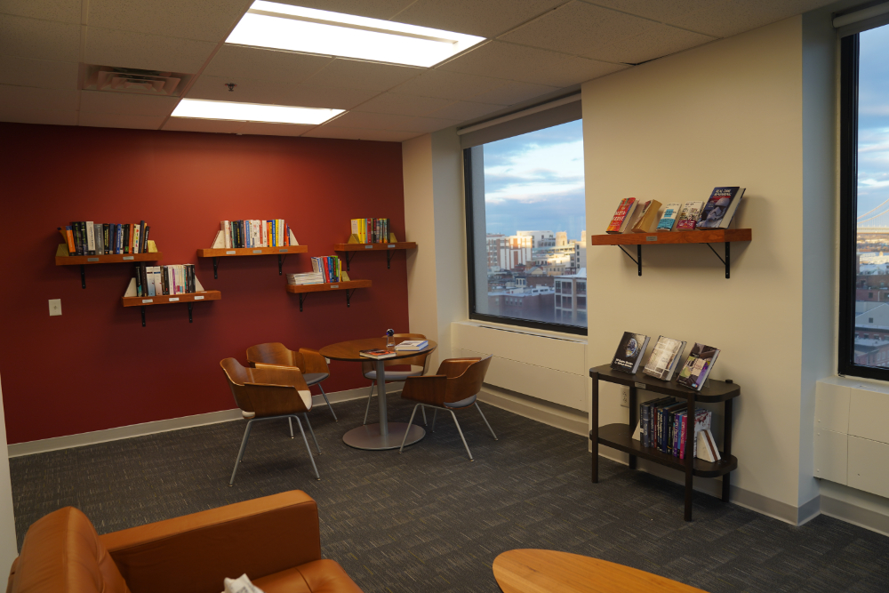

* This bulletpoint is necessary for kramdown to generate the ToC
{:toc}

# Conference Venue {#ConferenceVenue}

<!-- {: .venue-picture} -->

    

        <iframe src="https://drive.google.com/file/d/1GNzmEGDfyRHJtiPoPrprkjb4KjGR8INE/preview" class="img_sizing" allow="autoplay"></iframe>
    

### Cesium  will host I3D 2024!

We are pleased to announce that I3D 2024 will take place at Cesium in Philadelphia, PA, United States.

<!-- {: .venue-picture} -->
{: .venue-picture}

    

        
        
        
    

## Location 
Cesium office is located at:  
400 Market St, Philadelphia, PA 19106

    <iframe class="img_sizing" height="500px" src="https://www.google.com/maps/embed?pb=!1m18!1m12!1m3!1d2162.7631658920036!2d-75.14950469155715!3d39.950134825432386!2m3!1f0!2f0!3f0!3m2!1i1024!2i768!4f13.1!3m3!1m2!1s0x89c6c981093646d7%3A0xc117d14670c0778f!2sCesium!5e0!3m2!1sen!2shk!4v1710255557130!5m2!1sen!2shk"  allowfullscreen="" loading="lazy" referrerpolicy="no-referrer-when-downgrade"></iframe>

 
This is the entance to Cesium.

{: .venue-picture}

*More details will be provided in the near future*

# Lodging {#Lodging}
Here are some suggestions of hotels you could consider staying in. We don't have any agreement with them for the conference, so feel free to look around for other options that better match your needs.

__Wyndham Philadelphia Historic District__   400 Arch St, Philadelphia, PA 19106   Phone: 877-999-3223   [Website Link](https://www.wyndhamhotels.com/wyndham/philadelphia-pennsylvania/wyndham-philadelphia-historic-district/overview)

__Loews Philadelphia Hotel__   1200 Market St, Philadelphia, PA 19107   Phone: 1-877-878-3629   [Website Link](https://www.loewshotels.com/philadelphia-hotel/accommodations)

*We will provide more hotel suggestions later*

<!-- We will later suggest some the of hotels you could consider staying in. We don't have any agreement with them for the conference, so feel free to look around for other options that better match your needs. -->

